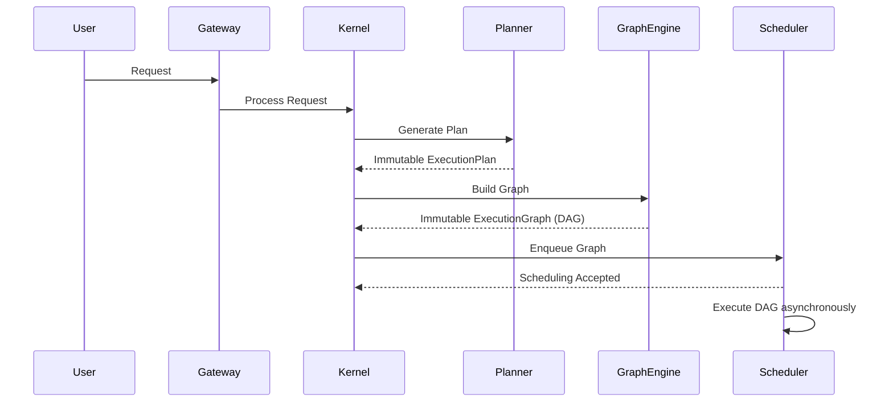

# Execution Architecture

```mermaid
sequenceDiagram
    participant User
    participant Gateway
    participant Kernel
    participant Planner
    participant GraphEngine
    participant Scheduler
    
    User->>Gateway: Request
    Gateway->>Kernel: Process Request
    Kernel->>Planner: Generate Plan
    Planner-->>Kernel: Immutable ExecutionPlan
    Kernel->>GraphEngine: Build Graph
    GraphEngine-->>Kernel: Immutable ExecutionGraph (DAG)
    Kernel->>Scheduler: Enqueue Graph
    Scheduler-->>Kernel: Scheduling Accepted
    Scheduler->>Scheduler: Execute DAG asynchronously
```
