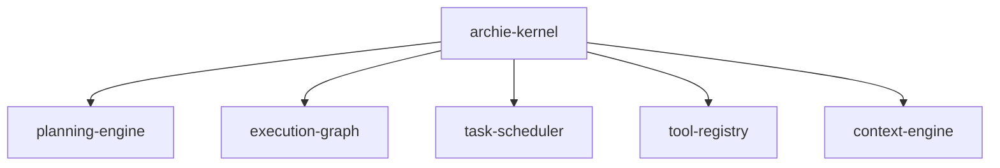

# Package Architecture

```mermaid
graph TD
    Kernel[archie-kernel]
    Plan[planning-engine]
    Graph[execution-graph]
    Sched[task-scheduler]
    Reg[tool-registry]
    Ctx[context-engine]
    
    Kernel --> Plan
    Kernel --> Graph
    Kernel --> Sched
    Kernel --> Reg
    Kernel --> Ctx
```
