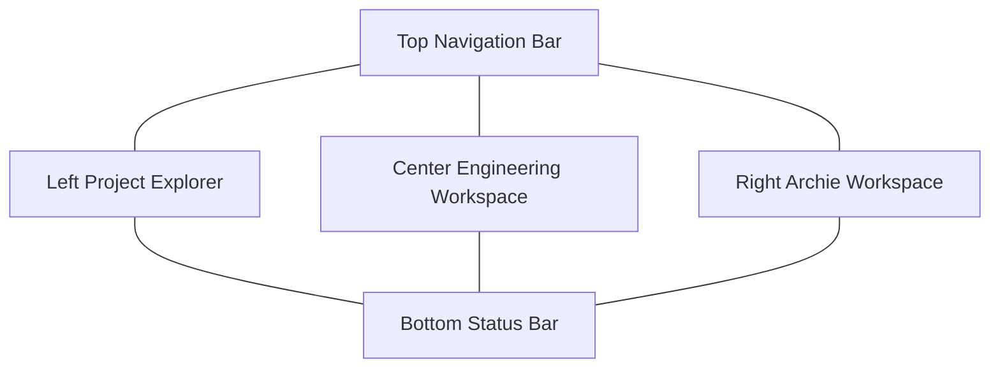

# BeamLab Layout System

The permanent 4-pane desktop layout:

- **Top Nav**: Global search, command palette trigger, workspace context.
- **Left Explorer**: File tree, structure hierarchy, model components.
- **Center Workspace**: Infinite canvas, 3D viewer, or code editor.
- **Right Archie Workspace**: The intelligence panel.
- **Bottom Status Bar**: System health, queue depth, metrics, diagnostics.\n